# Data_Analysis_Disasters_20th_Century

Please see the report in the ipynb file above, which shows data processing and analysis of some web-scraped data to do with natural disasters of the 20th Century. Below are the final charts and some explanation:

## Data Analysis

For this section I aimed to analyse the Pandas cleaned DataFrames I had been constructing for the project. 

This process aimed to start to understand the relationships between the subcategories of data of natural disasters.

### Analysis

  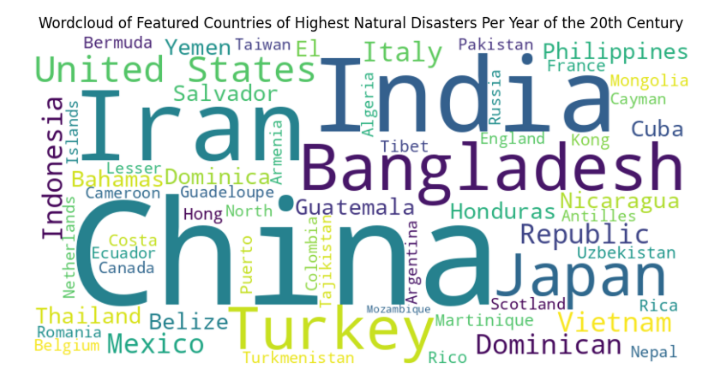

From this we can immediately see that China, Iran, and India are the main countries with natural disasters.

  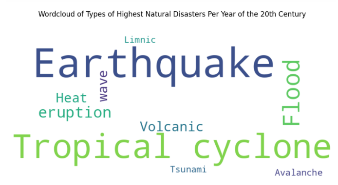

From this we can see that Earthquakes and Tropical cyclones are the most frequent events that feature within this dataset.
It would be interesting to see which specific types of disasters affect these countries the most, and if the highest countries and types correlate with each other.

  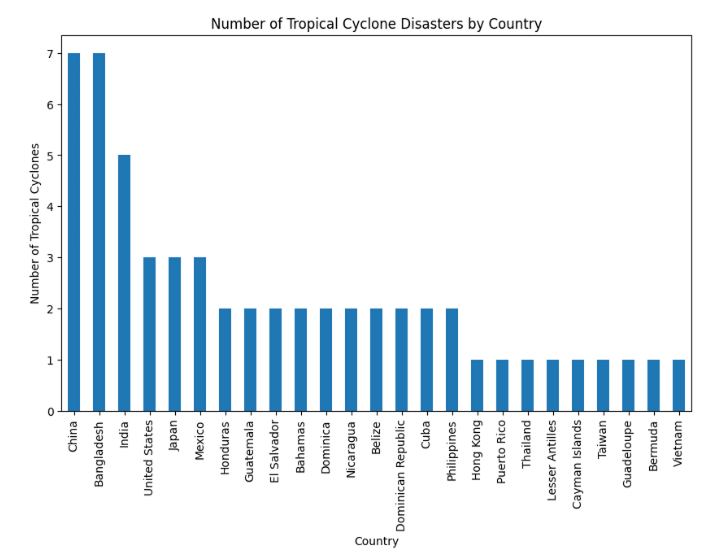

  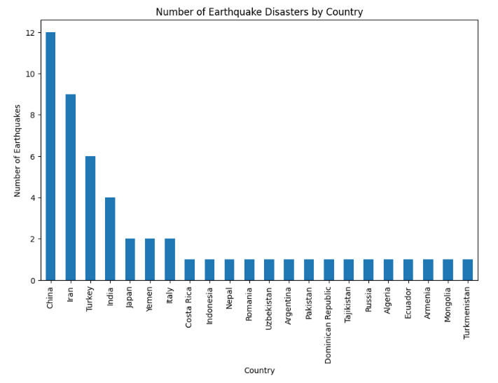

### Analysis
This correlates partially with the above wordcloud, however it shows Bangladesh as second highest for 'Tropical cyclone' and Iran is not on the board for Tropical cyclones, so there must be other types which are adding up the numbers for these three countries.

  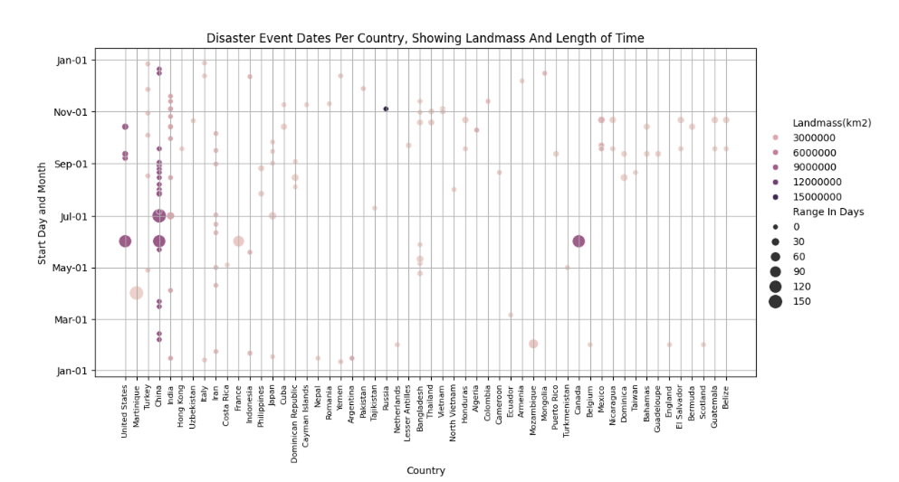

### Analysis
This is interesting as it shows which areas have disaster events at which time of year, so we can see a large range of countries have events happening between September and November.
We can also see that the longest length events in day are found starting between the end of May to Mid August.
We can also say that the biggest range in days seem to be mainly affecting the countries with the largest landmass.

  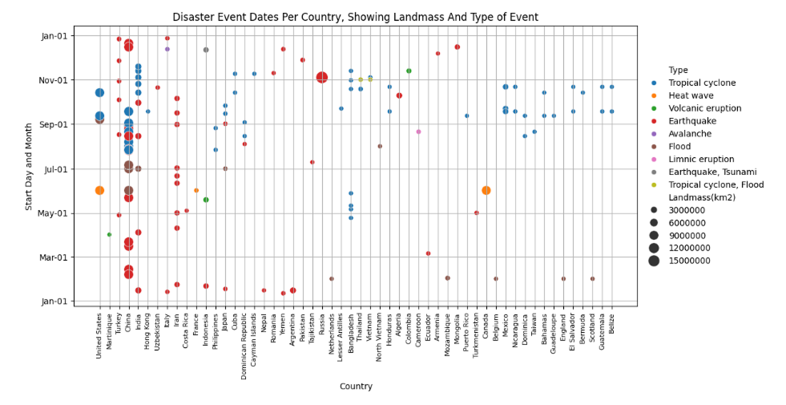

### Analysis
We can see here that the types of disaster that affect the largest landmass are Tropical cyclone, Flood, and Earthquake. This is then followed by Heatwave.
We can also see that the 'Tropical Cyclone' is a lot more frequent between mid July and mid November.
What can be noted for instance with 'Heatwave' is that is affecting The US, Canada, and France, and specifically in the month of June
These are typically colder countries, and it makes me think that if I was to pursue this data science project further, it would be interesting to categorize the current dataset into locations throughout the world geographically to see what areas are affected by different types.
Area 2 - A focus on Disaster Types and Death Toll Impacts

  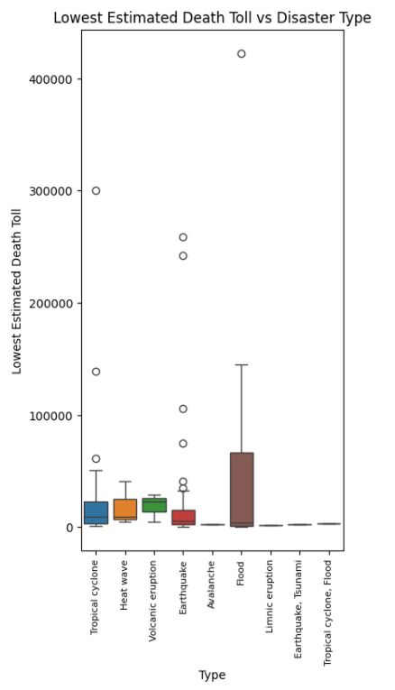

### Analysis
From this we can see that flood is the tye of disaster that has the highest range and highest amount of of deaths per event. This is followed by Earthquake, however there are a lot of outliers within the data for Earthquake, as the main amount of death tolls are in the lower range and are tightly close together.
We can see that Tropical cyclone and heatwave comparatively are in more of a similar range, and Avalanche, Liminic eruption, Earthquake( Tsunami) and Tropical Cyclone (Flood) have a very low death toll and do not deviate in size throughout this time period of 100 years.

  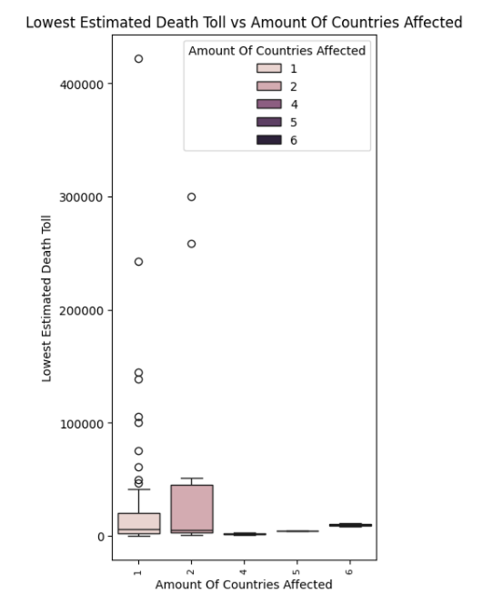

### Analysis
From what can be seen from the box plot, the most vaired ranges are in events where there are 1 and 2 countries involved, however more data points may be needed for events with 4, 5 and 6 countries involved, as within the dataset there were only a few events where this occurred.
If I was to develop this project in year 3 I would need to find more information about other events that may not have been just the highest in that year, but top 10 or 20, as then this would give more events where more countries were affected, in order to make a more detailed conclusion.

  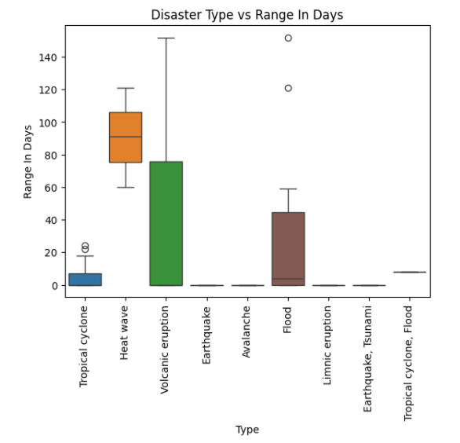

### Analysis
What can be seen within the boxplot is that the distribution of the heatwave boxplot is the least skewed of the larger items and looks proportional, 'Tropical Cyclone', 'Volcanic Eruption' and 'Flood' are all skewed downward. 'Volcani'c Eruption has the longest range of days in comparison to the others if you do not count the outliers in 'Flood'. All other have very minimal amount of days the disaster spans except 'Tropical cyclone, Flood', which has ~15 days.    

  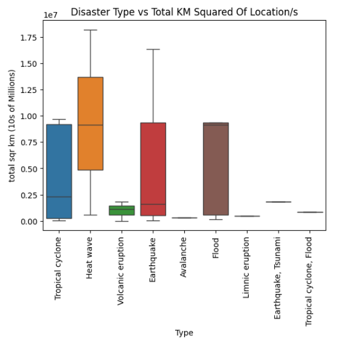

### Analysis
We can see that Floods, Earthquakes, Heatwaves and Tropical Cyclones affect the highest amount of countries with land area each time the event happens, however the have a large range, so some events can be in smaller locations also. The other types of disasters lean towards happening in areas that have a small landmass, with less of a span of land area.

  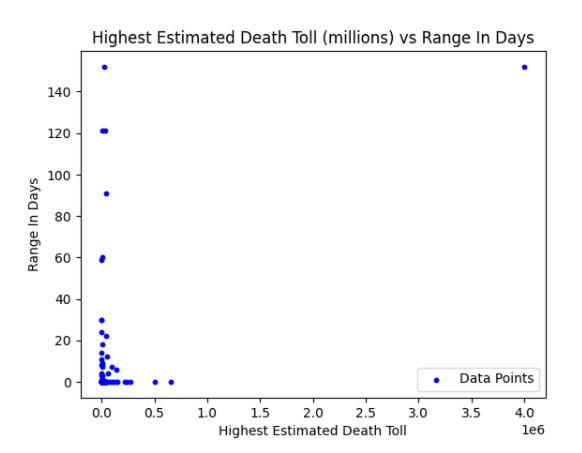
  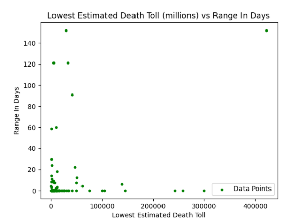

### Analysis
What we can learn from this is the highest cluster of data points are nearest to 0, however, other than the outlier, the data looks like the more days the disaster is, the data does not deviate, however the shorter the length in days of the disaster, the wider the range of the death toll.
However, due to the areas being quite sparce within the 'Range In Days' part of this table, I would be concerned about drawing a full conclusion about this without potentially finding more data to back this claim.

  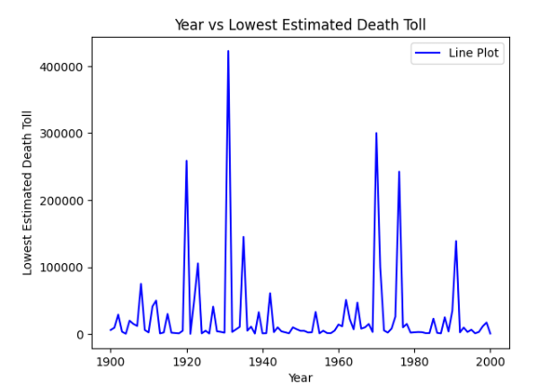
  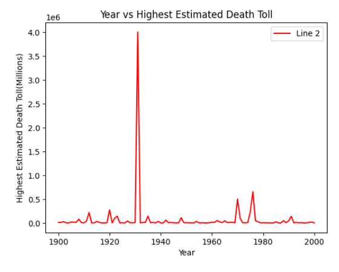

### Analysis
Within this we can see that there is quite a large difference between the lowest and highest estimated death tolls, per year, however what is noticed is that for both areas they agree that between 1920 and 1940 and between 1970 and 1980 there were more deaths reported.

  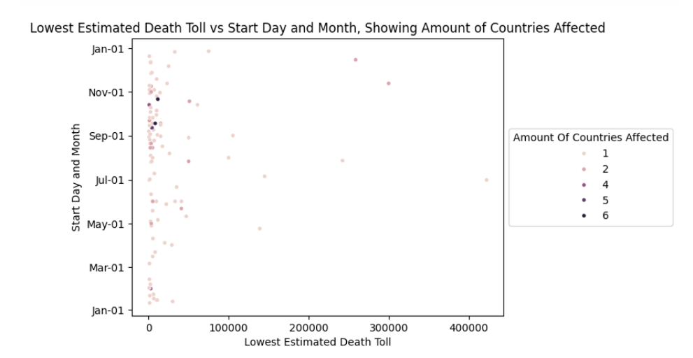

### Analysis
From this scatter plot we can see that there are some interesting groupings, for instance, overall there are higher group of natural disasters between the months of Auguest and November, with the highest amount of countries being affected within this region also. We can also see lower death tolls between the beginning of January and the end of April.

  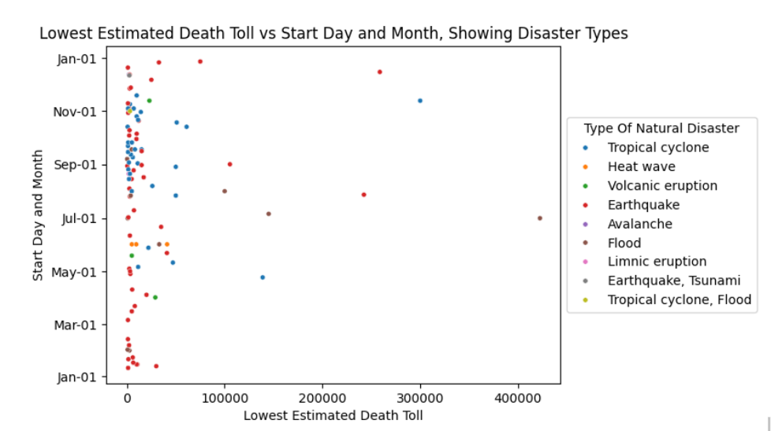

### Analysis
From this scatter plot we can see that there are some interesting groupings, for instance, we can see that tropical cyclones and to a lesser extent earthquakes affect between the months of August and November, which is correlating with the 'Country' Analysis that was conducted earlier, and this is potentially what is driving up the concentration of datapoints within this range.
Earthquakes seem to be the most spread out, affect all areas of the year, but are relatively low death toll except for between July and September.

### Conclusion

Overall there have been some interesting insights found from the data collected, such as the way certain types of disaster seem to have more impact with regards to the range of km of the impact areas, and the length in days. I think measuring the types and also the countries over time periods has also provided some interesting insights into there being certain countries and types that group together over certain periods within the year.
I think in order to expand this project further I would look to implementing a larger dataset, potentially adding more columns that can create further visualisations to provide insights. For instance these columns could be:
Population of countries within the time period
Landmass percentage (this is within the Worldometer dataset)
I would also look to expand the dataset to the top 10 or 20 disasters, and compare them separately with the current dataset to see if they correlate in some areas, or if there are differences, this will also back up some of the answers from this project further as I noticed that in some parts of charts the dataset was smaller than anticipated.

